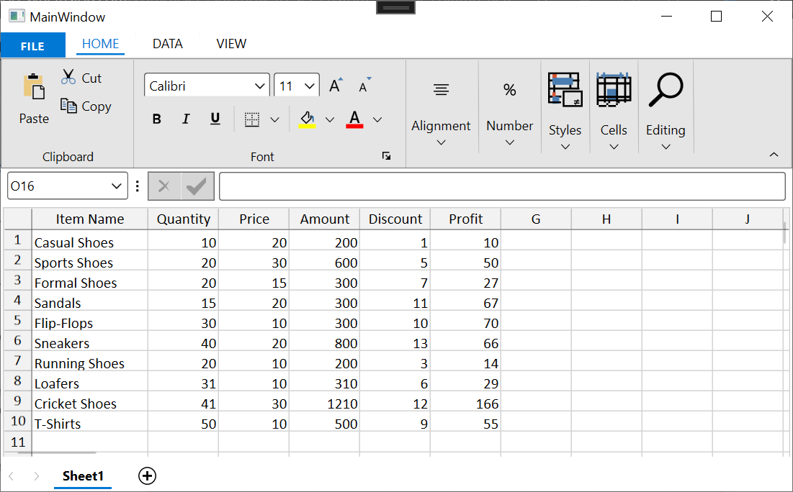

# How to set custom text for column header in WPF Spreadsheet

[WPF Spreadsheet](https://www.syncfusion.com/wpf-controls/spreadsheet) (SfSpreadsheet) does not contain direct support to set custom text for the column header. This can be achieved by overriding the [OnRender](https://help.syncfusion.com/cr/wpf/Syncfusion.UI.Xaml.Spreadsheet.CellRenderer.SpreadsheetHeaderCellRenderer.html#Syncfusion_UI_Xaml_Spreadsheet_CellRenderer_SpreadsheetHeaderCellRenderer_OnRender_Syncfusion_UI_Xaml_Grid_ScrollAxis_RowColumnIndex_System_Windows_Media_DrawingContext_System_Windows_Rect_Syncfusion_UI_Xaml_Spreadsheet_SpreadsheetColumn_System_Object_) method and customizing the [SpreadsheetHeaderCellRenderer](https://help.syncfusion.com/cr/wpf/Syncfusion.UI.Xaml.Spreadsheet.CellRenderer.SpreadsheetHeaderCellRenderer.html).
 
 ```C#
// Event subscription
spreadsheet.WorkbookLoaded += OnWorkbookLoaded; 

// Event customization
private void OnWorkbookLoaded(object sender, WorkbookLoadedEventArgs args)
{
    // Remove the default header cell renderer
    spreadsheet.ActiveGrid.CellRenderers.Remove("Header");
    // Add the custom header cell renderer
    spreadsheet.ActiveGrid.CellRenderers.Add("Header",new CustomHeaderCellRenderer());
}  

// Custom header cell renderer
public class CustomHeaderCellRenderer : SpreadsheetHeaderCellRenderer
{

    // Override the OnRender method
    protected override void OnRender(RowColumnIndex cellRowColumnIndex, DrawingContext dc, Rect cellRect, SpreadsheetColumn column, object textElement)
    {

        // Customize based on your scenario
        if(column.DisplayText == "A")
        {
            // Change the Header Text for A column
            column.DisplayText = "Item Name";  
        } 

        if (column.DisplayText == "B")
        {
            // Change the Header Text for B column
            column.DisplayText = "Quantity";
        } 

        if (column.DisplayText == "C")
        {
            // Change the Header Text for C column
            column.DisplayText = "Price";
        } 

        if (column.DisplayText == "D")
        {
            // Change the Header Text for D column
            column.DisplayText = "Amount";
        } 

        if (column.DisplayText == "E")
        {
            // Change the Header Text for E column
            column.DisplayText = "Discount";
        } 

        if (column.DisplayText == "F")
        {
            // Change the Header Text for F column
            column.DisplayText = "Profit";
        } 

        base.OnRender(cellRowColumnIndex, dc, cellRect, column, textElement);
    }
}
 ```

The following screenshot illustrates the custom text for the column header in [WPF Spreadsheet](https://www.syncfusion.com/wpf-controls/spreadsheet) (SfSpreadsheet),
 
 

Take a moment to peruse the [WPF Spreadsheet - Getting Started](https://help.syncfusion.com/wpf/spreadsheet/getting-started) documentation, where you can find about the spreadsheet with code examples.